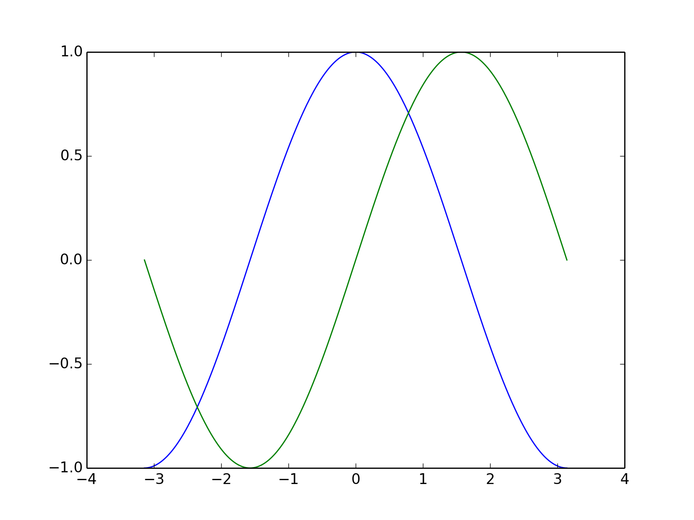
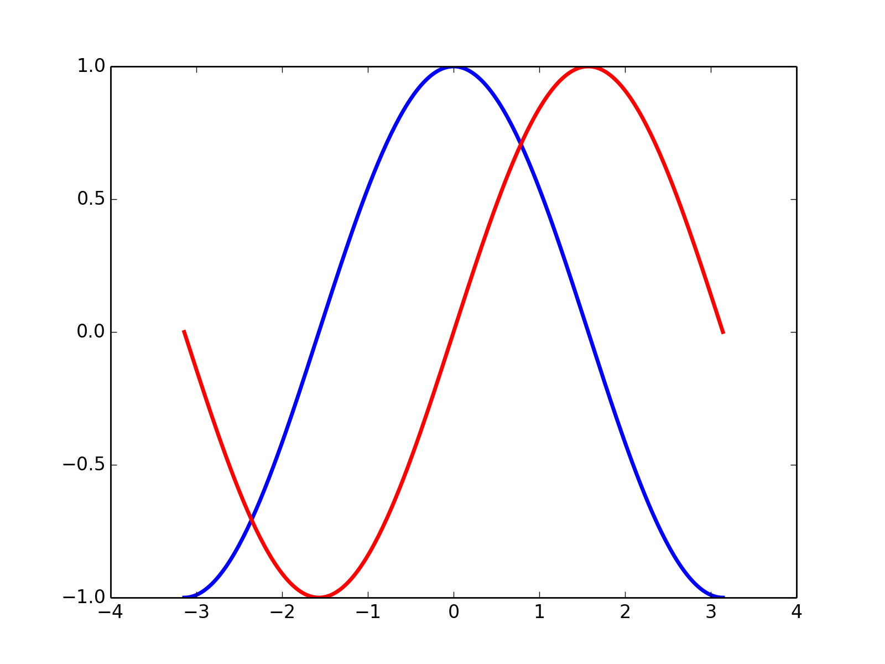
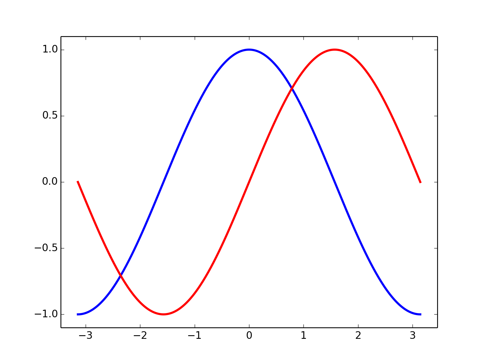
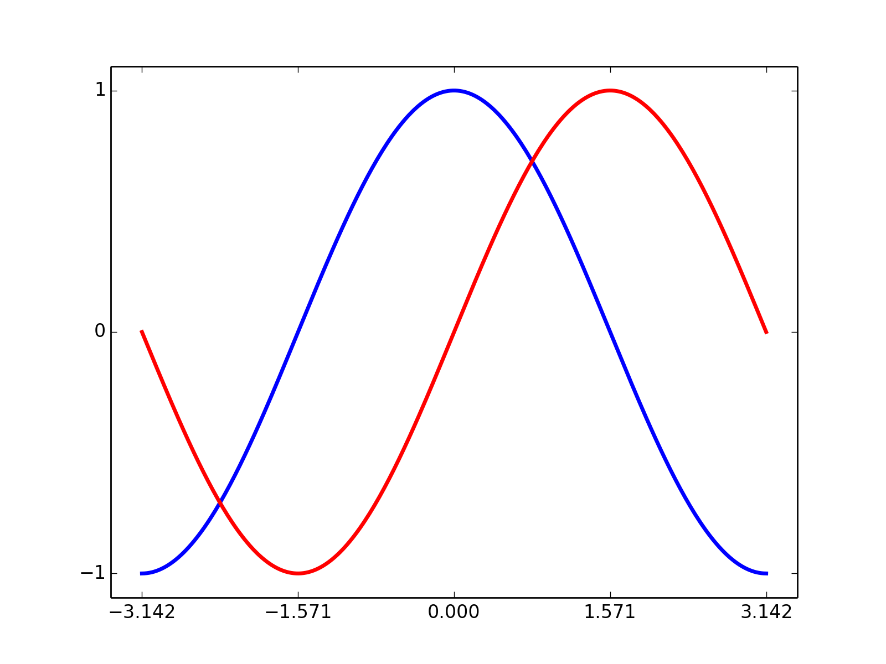

# Tutorial

This page is based on [Matplotlib: plotting](http://www.turbare.net/transl/scipy-lecture-notes/intro/matplotlib/matplotlib.html)
page in [scipy lecture notes](http://www.turbare.net/transl/scipy-lecture-notes/) 

Matplotlib page on scipy lecture notes shows step by step codes by python Matplotlib.
This page cites them, and add how to write in Matplotlib4j in **Java, Scala and Kotlin** for your understanding of Matplotlib4j.

So, let's start!

# Simple Plot

*[Original doc](http://www.turbare.net/transl/scipy-lecture-notes/intro/matplotlib/matplotlib.html#simple-plot)*

> In this section, we want to draw the cosine and sine functions on the same plot. 
> Starting from the default settings, we'll enrich the figure step by step to make it nicer.
> 
> First step is to get the data for the sine and cosine functions:

*Original in python:*
```python
import numpy as np

X = np.linspace(-np.pi, np.pi, 256)
C, S = np.cos(X), np.sin(X)
```

*Java:*
```java
List<Double> x = NumpyUtils.linspace(-Math.PI, Math.PI, 256);
List<Double> C = x.stream().map(xi -> Math.cos(xi)).collect(Collectors.toList());
List<Double> S = x.stream().map(xi -> Math.sin(xi)).collect(Collectors.toList());
```

*Scala:*
```scala
import scala.jdk.CollectionConverters._

val x = NumpyUtils.linspace(-Math.PI, Math.PI, 256)
val C = x.asScala.map(xi => Math.cos(xi)).map(Double.box).asJava
val S = x.asScala.map(xi => Math.sin(xi)).map(Double.box).asJava
```

Note that in scala, converting java List to scala List is needed.
In addition to that, boxing the elements are also required.

*Kotlin:*
```kotlin
val x = NumpyUtils.linspace(-Math.PI, Math.PI, 256)
val C = x.map { xi -> Math.cos(xi!!) }.toList()
val S = x.map { xi -> Math.sin(xi!!) }.toList()
```

> `X` is now a numpy array with 256 values ranging from -π to +π (included). 
> `C` is the cosine (256 values) and S is the sine (256 values).


## Plotting with default settings



> Matplotlib comes with a set of default settings that allow customizing all kinds of properties. 
> You can control the defaults of almost every property in matplotlib: figure size and dpi, line width, 
> color and style, axes, axis and grid properties, text and font properties and so on.

You must see that all the languages here have almost the same form of writing to handle `plt` object as below.

*Original in python:*
```python
import numpy as np
import matplotlib.pyplot as plt

X = np.linspace(-np.pi, np.pi, 256, endpoint=True)
C, S = np.cos(X), np.sin(X)

plt.plot(X, C)
plt.plot(X, S)

plt.show()
```

*Java:*
```java
List<Double> x = NumpyUtils.linspace(-Math.PI, Math.PI, 256);
List<Double> C = x.stream().map(xi -> Math.cos(xi)).collect(Collectors.toList());
List<Double> S = x.stream().map(xi -> Math.sin(xi)).collect(Collectors.toList());

Plot plt = Plot.create();
plt.plot().add(x, C);
plt.plot().add(x, S);
plt.show();
```

*Scala:*
```scala
import scala.jdk.CollectionConverters._

val x = NumpyUtils.linspace(-Math.PI, Math.PI, 256)
val C = x.asScala.map(xi => Math.cos(xi)).map(Double.box).asJava
val S = x.asScala.map(xi => Math.sin(xi)).map(Double.box).asJava

val plt = Plot.create()
plt.plot.add(x, C)
plt.plot.add(x, S)
plt.show()
```

*Kotlin:*
```kotlin
val x = NumpyUtils.linspace(-Math.PI, Math.PI, 256)
val C = x.map { xi -> Math.cos(xi!!) }.toList()
val S = x.map { xi -> Math.sin(xi!!) }.toList()

val plt = Plot.create()
plt.plot().add(x, C)
plt.plot().add(x, S)
plt.show()
```


## Changing colors and line widths



> First step, we want to have the cosine in blue and the sine in red and a slighty thicker line 
> for both of them. We'll also slightly alter the figure size to make it more horizontal.

*Original in python:*
```python
...
plt.plot(X, C, color="blue", linewidth=2.5, linestyle="-")
plt.plot(X, S, color="red",  linewidth=2.5, linestyle="-")
...
```

*Java:*
```java
...
plt.plot().add(x, C).color("blue").linewidth(2.5).linestyle("-");
plt.plot().add(x, S).color("red").linewidth(2.5).linestyle("-");
...
```

*Scala:*
```scala
...
plt.plot.add(x, C).color("blue").linewidth(2.5).linestyle("-")
plt.plot.add(x, S).color("red").linewidth(2.5).linestyle("-")
...
```

*Kotlin:*
```kotlin
...
plt.plot().add(x, C).color("blue").linewidth(2.5).linestyle("-")
plt.plot().add(x, S).color("red").linewidth(2.5).linestyle("-")
...
```


## Setting limits



> Current limits of the figure are a bit too tight and we want to make some space in order to clearly see all data points.
  
*Original in python:*
```python
...
plt.xlim(X.min() * 1.1, X.max() * 1.1)
plt.ylim(C.min() * 1.1, C.max() * 1.1)
...
```

*Java:*
```java
...
plt.xlim(Collections.min(x) * 1.1, Collections.max(x) * 1.1);
plt.ylim(Collections.min(C) * 1.1, Collections.max(C) * 1.1);
...
```

*Scala:*
```scala
...
plt.xlim(x.asScala.min * 1.1, x.asScala.max * 1.1)
plt.ylim(C.asScala.min * 1.1, C.asScala.max * 1.1)
...
```

*Kotlin:*
```kotlin
...
plt.xlim(x.min()!! * 1.1, x.max()!! * 1.1)
plt.ylim(C.min()!! * 1.1, C.max()!! * 1.1)
...
```


## Setting ticks



> Current ticks are not ideal because they do not show the interesting values (+/-π,+/-π/2) for sine and cosine. We'll change them such that they show only these values.

> :warning: `.xticks()` and `.yticks()` are supported in `>=0.6.0`

*Original in python:*
```python
...
plt.xticks([-np.pi, -np.pi/2, 0, np.pi/2, np.pi])
plt.yticks([-1, 0, +1])
...
```

*Java:*
```java
...
plt.xticks(Arrays.asList(-Math.PI, -Math.PI / 2, 0, Math.PI / 2, Math.PI));
plt.yticks(Arrays.asList(-1, 0, 1));
...
```

*Scala:*
```scala
...
plt.xticks(Seq(-Math.PI, -Math.PI / 2, 0.0, Math.PI / 2, Math.PI).map(Double.box).asJava)
plt.yticks(Seq(-1.0, 0.0, 1.1).map(Double.box).asJava)
...
```

*Kotlin:*
```kotlin
...
plt.xticks(listOf(-Math.PI, -Math.PI / 2, 0, Math.PI / 2, Math.PI))
plt.yticks(listOf(-1, 0, 1))
...
```